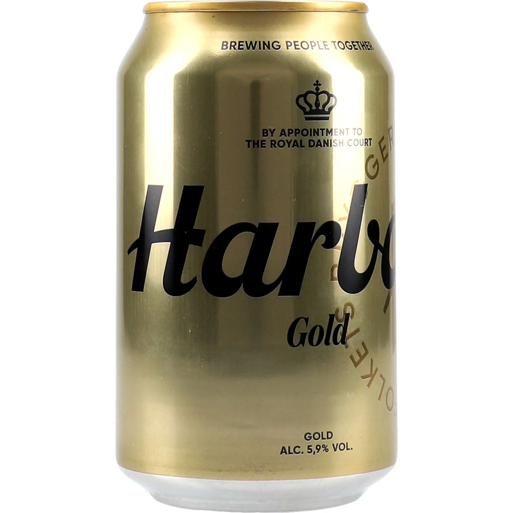
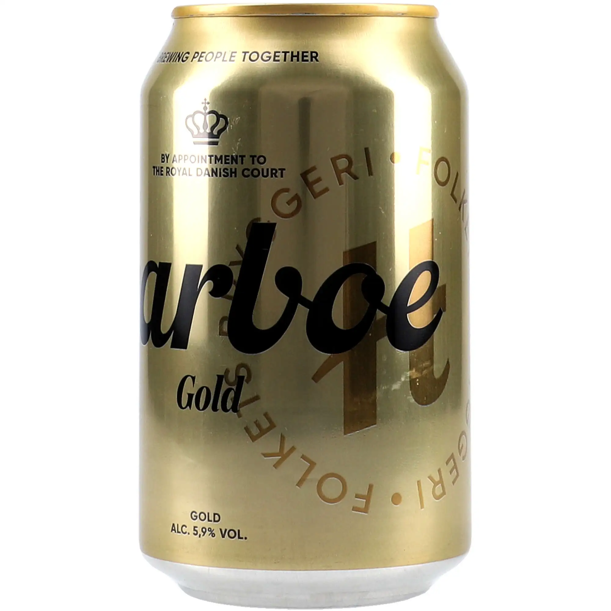
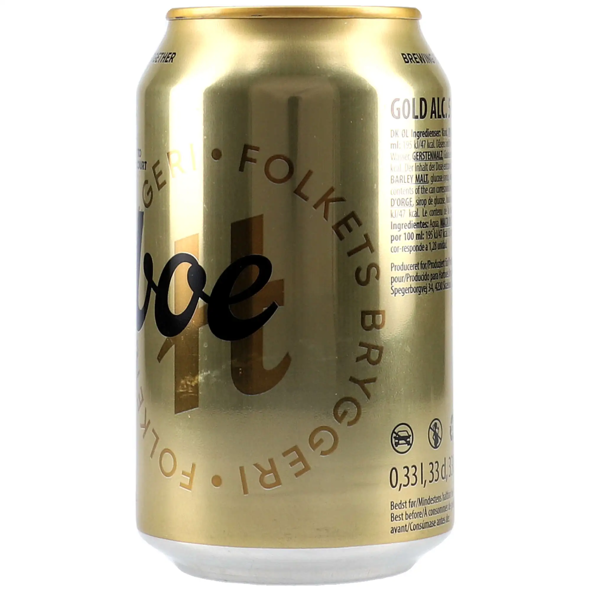
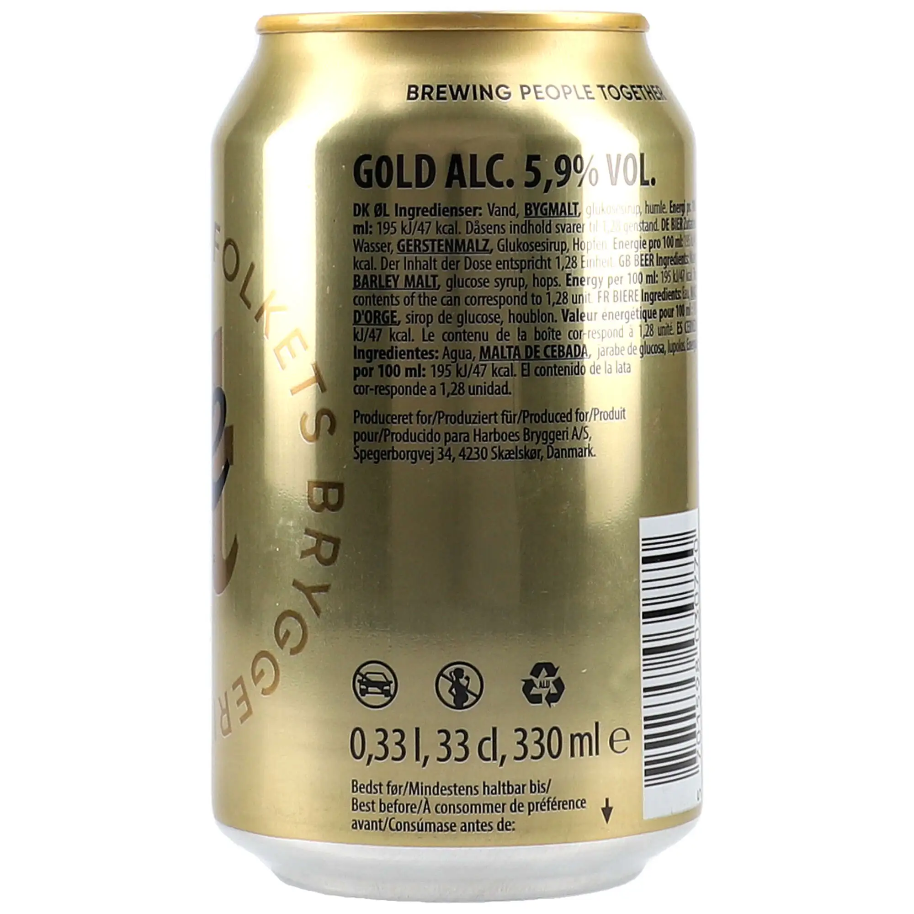
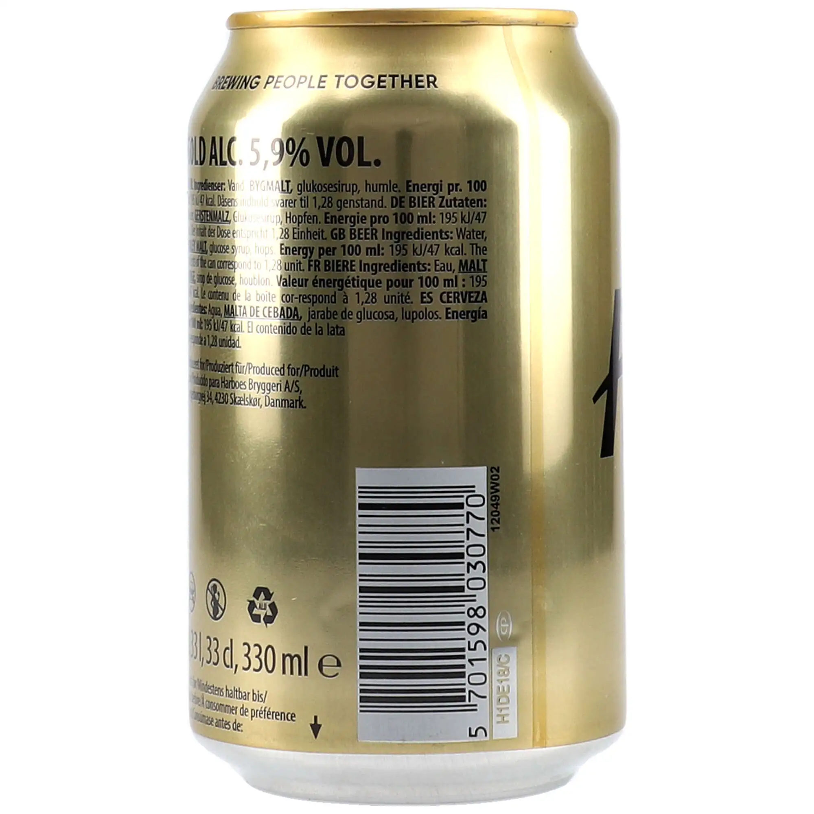
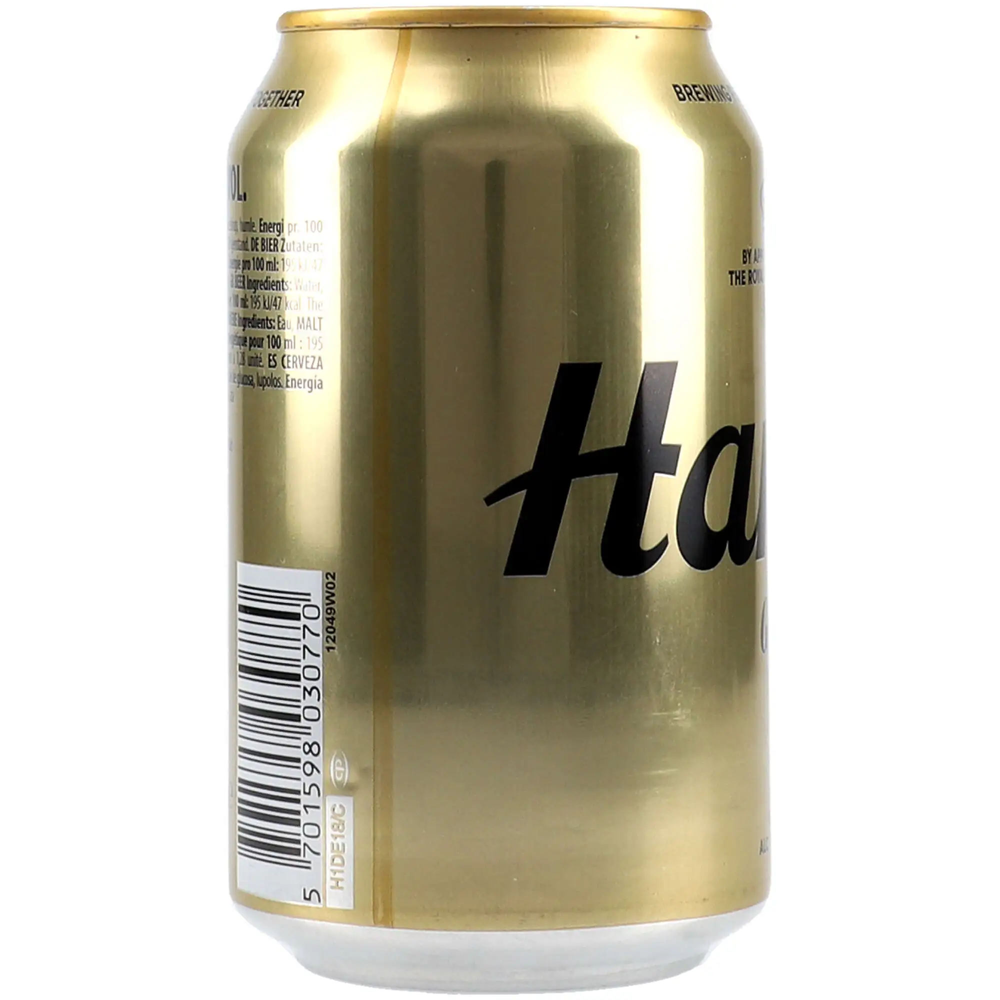

# Harboe Beer Gold 5,9 % — описание банки

Источник: <https://alkojuomat.com/product/oluet/harboe-beer-gold-59/> (артикул на сайте `01-01-0039`).
Все 6 фотографий товара из галереи сохранены в оригинальном размере (2000 × 2000 px, WebP) в папке [`images/`](images/).

Данные в описании взяты с самой банки (фото 1–6). Отдельно помечено то, что взято со страницы товара.

---

## Фотографии

| № | Фото | Файл | Что на фото | Alt-текст для сайта (FI) |
|---|------|------|-------------|--------------------------|
| 1 |  | `01-01-0039_1.webp` | Лицевая сторона: слоган, королевская корона, логотип Harboe, надпись Gold, крепость 5,9 % | Harboe Beer Gold 5,9 % 0,33 l tölkki edestä – kullanvärinen tölkki, musta Harboe-logo ja kuninkaallinen kruunu |
| 2 |  | `01-01-0039_2.webp` | Лицевая сторона с поворотом: логотип «Harboe Gold», бронзовая монограмма «H» в кольце FOLKETS BRYGGERI | Harboe Beer Gold 5,9 % tölkki – Harboe Gold -logo ja pronssinvärinen H-monogrammi |
| 3 |  | `01-01-0039_3.webp` | Боковая сторона: крупная кольцевая надпись FOLKETS BRYGGERI, начало информационной панели | Harboe Beer Gold 5,9 % tölkki sivulta – teksti Folkets Bryggeri |
| 4 |  | `01-01-0039_4.webp` | Оборот: состав на 5 языках, производитель, пиктограммы, объём 330 мл, срок годности | Harboe Beer Gold 5,9 % tölkin takapuoli – ainesosat, energiasisältö ja tilavuus 330 ml |
| 5 |  | `01-01-0039_5.webp` | Оборот (правее): окончание состава и штрихкод EAN 5701598030770 | Harboe Beer Gold 5,9 % tölkin takapuoli – viivakoodi EAN 5701598030770 |
| 6 |  | `01-01-0039_6.webp` | Боковая сторона: штрихкод и начало логотипа Harboe | Harboe Beer Gold 5,9 % tölkki sivulta – viivakoodi ja Harboe-logo |

Сейчас на сайте у всех шести фото одинаковый alt «Harboe Beer Gold 5,9 %». Лучше дать каждому свой alt из последней колонки.

---

## Внешний вид банки

**Общее**
- Стандартная алюминиевая банка 0,33 л.
- Корпус целиком глянцевый, цвета «золотой металлик». Верхний край тоже золотой, дно из некрашеного серебристого алюминия.
- Цвета: золото, чёрный и бронза. Дизайн минималистичный, без фоновых картинок, выглядит «премиально».

**Лицевая сторона (фото 1–2)**
- Вверху слоган **BREWING PEOPLE TOGETHER** чёрными прописными буквами.
- Под ним чёрная **датская королевская корона** и надпись **BY APPOINTMENT TO THE ROYAL DANISH COURT** («Поставщик Датского королевского двора»).
- В центре крупный чёрный **рукописный логотип Harboe**, он огибает банку. Под ним слово **Gold** жирным чёрным шрифтом с засечками.
- На фоне большая бронзовая стилизованная буква **«H»** в кольце из надписи **FOLKETS BRYGGERI • FOLKETS BRYGGERI •** (по-датски «Народная пивоварня»).
- Внизу надпись **GOLD / ALC. 5,9% VOL.**

**Боковые стороны (фото 3 и 6)**
- С одной стороны кольцевая надпись FOLKETS BRYGGERI и бронзовая «H» переходят в информационную панель.
- С другой стороны вертикально стоит штрихкод на светлой плашке, рядом начинается логотип «Ha…».

**Оборотная сторона (фото 4–5)**
- Заголовок **GOLD ALC. 5,9% VOL.**
- Состав и энергетическая ценность на 5 языках: датском (DK), немецком (DE), английском (GB), французском (FR) и испанском (ES).
- Производитель: *Produced for Harboes Bryggeri A/S, Spegerborgvej 34, 4230 Skælskør, Danmark*.
- Три пиктограммы: перечёркнутый автомобиль (не пить за рулём), перечёркнутая беременная женщина (не для беременных) и знак переработки **ALU**.
- Объём: **0,33 l, 33 cl, 330 ml ℮**.
- «Best before / Bedst før / Mindestens haltbar bis…» и стрелка вниз: срок годности напечатан на дне банки.
- Штрихкод **EAN-13 5701598030770** (570 — код Дании) и служебные коды `12049W02`, `H1DE18/C`.

---

## Данные с банки

| Параметр | Значение |
|----------|----------|
| Название | Harboe Gold (на сайте: Harboe Beer Gold 5,9 %) |
| Напиток | Пиво (ØL / BIER / BEER / BIERE / CERVEZA). По данным сайта: светлый лагер, фильтрованное |
| Крепость | 5,9 % об. |
| Объём | 0,33 л / 33 cl / 330 мл ℮ |
| Состав | вода, **ячменный солод**, глюкозный сироп, хмель |
| Аллерген | ячменный солод (содержит глютен), выделен на банке |
| Энергетическая ценность | 195 кДж / 47 ккал на 100 мл (≈ 644 кДж / 155 ккал на банку) |
| Алкогольные единицы | 1,28 на банку (1 единица = 12 г чистого спирта) |
| Производитель | произведено для Harboes Bryggeri A/S, Spegerborgvej 34, 4230 Skælskør, Дания |
| Статус | поставщик Датского королевского двора (By appointment to the Royal Danish Court) |
| Штрихкод | EAN-13 5701598030770 |
| Предупреждения | не пить за рулём, не для беременных |
| Переработка | алюминий (ALU) |
| Срок годности | указан на дне банки |
| Упаковка (по данным сайта) | 24 × 0,33 л |

---

## Готовое описание для карточки товара (RU)

**Harboe Beer Gold 5,9 %** — крепкий светлый датский лагер в фирменной золотой банке 0,33 л. Банка целиком покрыта глянцевым «золотым металликом». В центре крупный чёрный рукописный логотип Harboe и надпись Gold, на фоне бронзовая монограмма «H» в кольце из слов FOLKETS BRYGGERI («Народная пивоварня»). Над логотипом датская королевская корона и надпись *By appointment to the Royal Danish Court*: пивоварня Harboes Bryggeri из Скельскёра — поставщик Датского королевского двора. Вверху банки фирменный слоган *Brewing people together*.

Состав: вода, ячменный солод, глюкозный сироп, хмель. Энергетическая ценность 47 ккал (195 кДж) на 100 мл, около 155 ккал в банке. Ячменный солод даёт насыщенный солодовый вкус с лёгкой сладостью, а хмель — приятную горчинку. Подавать охлаждённым до 8–10 °C. В упаковке 24 банки по 0,33 л.

## Tuotekuvaus sivustolle (FI)

**Harboe Beer Gold 5,9 %** on vahva tanskalainen vaalea lager, jonka tunnistaa kullanvärisestä 0,33 litran tölkistä. Tölkin kiiltävää kultapintaa hallitsevat musta, kaunokirjoitusta muistuttava Harboe-logo ja sana Gold. Taustalla on pronssinvärinen H-monogrammi, jota kiertää teksti FOLKETS BRYGGERI (”kansan panimo”). Logon yläpuolella on Tanskan kuninkaallinen kruunu ja teksti *By appointment to the Royal Danish Court* – Skælskørissa toimiva Harboes Bryggeri on Tanskan kuninkaallisen hovin hovihankkija. Tölkin yläreunassa on panimon iskulause *Brewing people together*.

Ainesosat: vesi, ohramallas, glukoosisiirappi ja humala. Energiaa 195 kJ / 47 kcal / 100 ml (noin 155 kcal tölkissä). Ohramallas antaa oluelle täyteläisen ja hieman makean maltaisen maun, jota humalan kitkeryys tasapainottaa. Suositeltu tarjoilulämpötila 8–10 °C. Tölkin sisältö vastaa 1,28 alkoholiannosta. Pakkauskoko 24 × 0,33 l.
